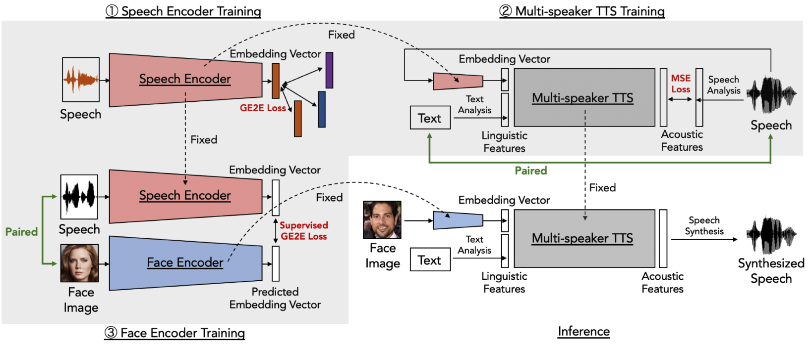

# Face2Speech

This is a project page for Face2Speech.  
"Multi-speaker text-to-speech synthesis using an embedding vector based on a face image", by S. Goto, K. ohnishi, Y. Saito, K. Tachibana and K. Mori.

* You can check paper and poster in [pdf](docs/Face2Speech_ASJ.pdf) and [poster](docs/ASJ2020y.pdf) (in Japanese).  
* Please check our samples in [demo page](https://dena.github.io/Face2Speech/)

